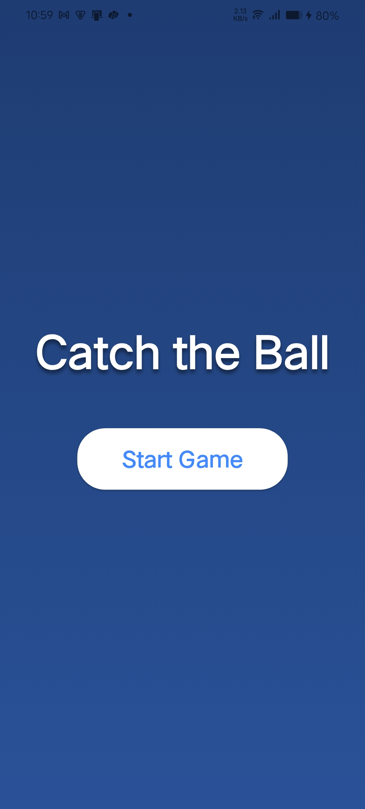
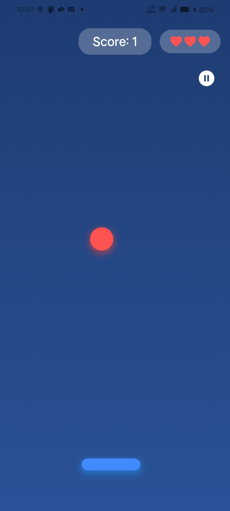

# Catch the Ball

A complete 2D "Catch the Ball" game built using Flutter.

## Screenshots

  
  

## Features

- **Dynamic Gameplay**: A falling ball that the player must catch using a controlled basket.
- **Player Controls**: Intuitive player-controlled basket.
- **Score & Lives**: Real-time score tracking and lives counter.
- **Progressive Difficulty**: Increasing difficulty as the game progresses to keep the player challenged.
- **Smooth Animations**: Fluid animations for an engaging experience.
- **Clean Architecture**: Built with maintainability and scalability in mind using clean architecture principles.
- **Responsive Design**: Adapts beautifully to different screen sizes.

## Getting Started

To run this project locally, ensure you have Flutter installed on your machine.

1.  Clone the repository.
2.  Run `flutter pub get` to install dependencies.
3.  Run `flutter run` to launch the game on your connected device or emulator.

For more information on getting started with Flutter development, please refer to the [official documentation](https://flutter.dev/docs).
